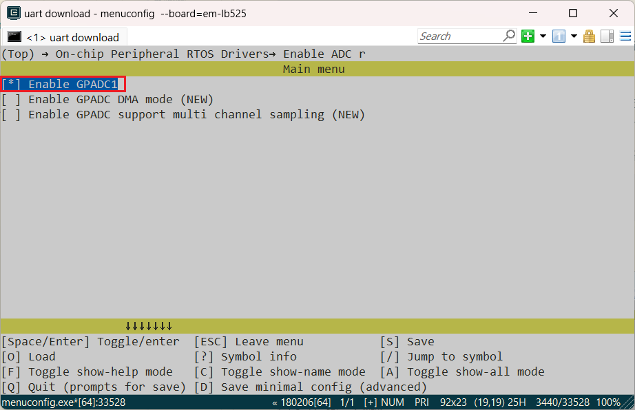
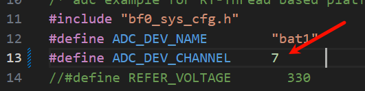
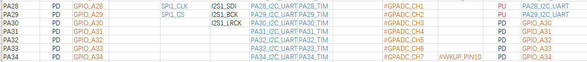

# ADC_Battery Example
Source Code Path: example/rt_device/adc/adc_battery

## Supported Platforms
This example can run on the following development boards:
* em-lb525
* T-Display-sf32

## Overview
* Under the RT-Thread operating system, the ADC single-channel sampling reads the VBAT battery voltage.

## How to Use the Example
### Compilation and Flashing
* This example uses ADC. In the RT-Thread operating system, the ADC peripheral is virtualized as an `rt_device` for read and write operations. Ensure that the following three macros are included in the `rtconfig.h` file:

```c
#define BSP_USING_ADC 1
#define BSP_USING_ADC1 1
#define RT_USING_ADC 1
```

Only when the above macros are included, the `sifli_adc_init` function will register the `"bat1"` `rt_device` through the `rt_hw_adc_register` function. This device can then be successfully found and controlled using `rt_device_find` and `rt_device_control`.<br>
**Note**<br>
SiFli series MCUs support multi-channel simultaneous sampling triggered by timer interrupts. Refer to the `BSP_GPADC_SUPPORT_MULTI_CH_SAMPLING` macro definition and the chip user manual for details.
* If the above macros are missing, enable them using the `menuconfig` command as shown below:

> scons --board=t-display-sf32 --menuconfig

As shown in the figure below, select GPADC1, save, and exit menuconfig. Then check if the macros are generated in `rtconfig.h`.

* Navigate to the project directory of the example and run the `scons` command to compile:

```
scons --board=t-display-sf32_hcpu -j8
```

* Run `build_t-display-sf32_hcpu\uart_download.bat` and follow the prompts to select the port for flashing:

```
build_t-display-sf32_hcpu\uart_download.bat

Uart Download

please input the serial port num:5
```

#### Example Output:
* Voltage log before connecting the battery:


* Voltage log after connecting the battery:


The log displays the raw register value as `value` and the converted voltage in mV as `Voltage`.

#### ADC Configuration Process

* Set the channel corresponding to the VBAT interface of the battery to channel 7:


**Note**  
1. The ADC input pins are fixed IO pins, as shown below:<br>For the 52 chip, ADC CH1-7 corresponds to software-configured Channel0-6. The last channel, CH8 (Channel 7), is internally connected to VBAT for battery detection and is not mapped to external IO.<br>

2. The last parameter of `HAL_PIN_Set` and `HAL_PIN_Set_Analog` is for selecting hcpu/lcpu. Use `1` for hcpu and `0` for lcpu.<br>

* Use `rt_device_find` and `rt_device_control` to find and configure the `bat1` device interface functions.  
The `rt_adc_ops` does not define `rt_device_open`, so not calling `rt_device_open` will not affect ADC functionality but will affect whether `bat1` appears as open in `list_device`.

```c
#define ADC_DEV_NAME        "bat1"      /* ADC1 device registered in rt_hw_adc_register, do not modify */
#define ADC_DEV_CHANNEL     7           /* ADC channel selection, VBAT is fixed as CH8 (Channel 7) */
//#define REFER_VOLTAGE       330         /* ADC reference voltage, fixed at 3.3V for the 52 chip */
static rt_device_t s_adc_dev; /* Define an rt_device */
static rt_adc_cmd_read_arg_t read_arg;

void adc_example(void)
{
    rt_err_t r;

    /* Configure PA28 as an analog input pin without enabling internal pull-up/pull-down */
    //HAL_PIN_Set_Analog(PAD_PA28, 1);

    /* Find the bat1 device. If BSP_USING_ADC1 is not enabled, the device will not be found, causing a crash */
    s_adc_dev = rt_device_find(ADC_DEV_NAME);

    /* Set the sampling channel to channel 0 */
    read_arg.channel = ADC_DEV_CHANNEL;

    r = rt_adc_enable((rt_adc_device_t)s_adc_dev, read_arg.channel);
    
    /* This interface calls sifli_adc_control to read once. Users can process the data as needed. */   
    r = rt_device_control(s_adc_dev, RT_ADC_CMD_READ, &read_arg.channel);
    /* The log displays the value in 0.1mV. For example, 20846 equals 2084.6mV or 2.0846V. */
    LOG_I("adc channel:%d,value:%d",read_arg.channel,read_arg.value);

    /* Demonstrating another way to perform ADC sampling. This interface calls sifli_get_adc_value and averages 22 times by default. */
    rt_uint32_t value = rt_adc_read((rt_adc_device_t)s_adc_dev, ADC_DEV_CHANNEL);
    /* The log displays the value in 0.1mV. For example, 20700 equals 2070.0mV or 2.0700V. */
    LOG_I("rt_adc_read:%d,value:%d",read_arg.channel,value);

    /* Disable the ADC after sampling */
    rt_adc_disable((rt_adc_device_t)s_adc_dev, read_arg.channel);
}
```

## Troubleshooting
* Program crashes with the following log:
```c
   Start adc demo!
   Assertion failed at function:rt_adc_enable, line number:144 ,(dev)
   Previous ISR enable 0
```
Cause:  
`BSP_USING_ADC1` is not defined, so the `rt_hw_adc_register` function does not register `"bat1"`. This causes `rt_device_find` to crash.  
Ensure the following macros are included in the `rtconfig.h` file:
```c
#define BSP_USING_ADC 1
#define BSP_USING_ADC1 1
#define RT_USING_ADC 1
```
* Incorrect ADC sampled voltage value:

1. Use the `list_device` command to check if the `bat1` device exists. The ADC driver does not require `rt_device_open` to open the `bat1` device for functionality.
```
    msh />
 TX:list_device
    list_device
    device           type         ref count
    -------- -------------------- ----------
    audcodec Sound Device         0       
    audprc   Sound Device         0       
    rtc      RTC                  0       
    pwm3     Miscellaneous Device 0       
    pwm2     Miscellaneous Device 0       
    touch    Graphic Device       0       
    lcdlight Character Device     0       
    lcd      Graphic Device       0       
    bat1     Miscellaneous Device 0       
    i2c4     I2C Bus              0       
    i2c1     I2C Bus              0       
    spi1     SPI Bus              0       
    lptim1   Timer Device         0       
    btim1    Timer Device         0       
    gptim1   Timer Device         0       
    uart2    Character Device     0       
    uart1    Character Device     2       
    pin      Miscellaneous Device 0       
    msh />
```
2. Check if the ADC hardware is correctly connected. The ADC sampling channel is fixed to specific IO pins. Refer to the chip manual for details on CH0-7 pin mappings.  
3. Ensure the ADC input voltage is within the range of 0V to the reference voltage (3.3V for the 52 chip). Do not exceed this range.  

* Insufficient ADC accuracy:
1. Verify if ADC calibration parameters are obtained and used.  
2. Check if the precision of the voltage divider resistors meets the requirements.  
3. Ensure the ADC reference voltage is stable and free of excessive ripple (refer to the chip manual for details).

## Reference Documents
* EH-SF32LB52X_Pin_config_V1.3.0_20231110.xlsx
* DS0052-SF32LB52x Chip Technical Specification V0p3.pdf
* [RT-Thread Official Website](https://www.rt-thread.org/document/site/#/rt-thread-version/rt-thread-standard/programming-manual/device/adc/adc)<br>
https://www.rt-thread.org/document/site/#/rt-thread-version/rt-thread-standard/programming-manual/device/adc/adc

## Revision History
| Version | Date   | Release Notes |
|:-------|:-------|:--------------|
| 0.0.1  | 11/2024 | Initial version |
|        |         |                |
