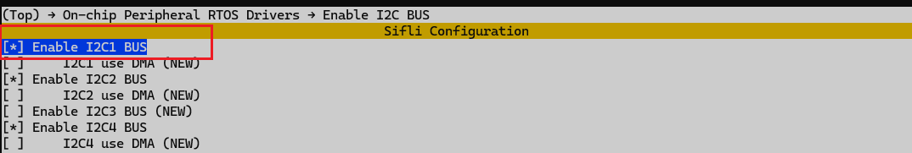
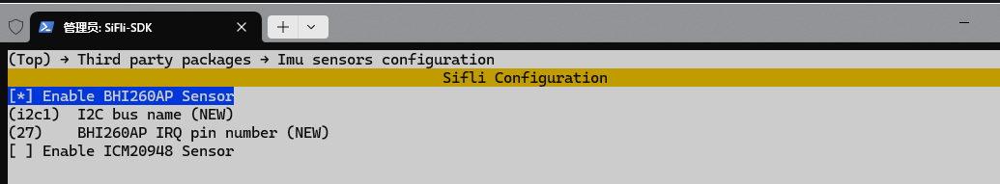
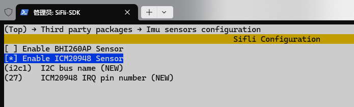
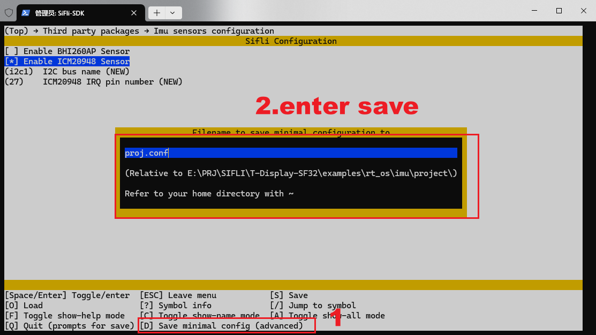
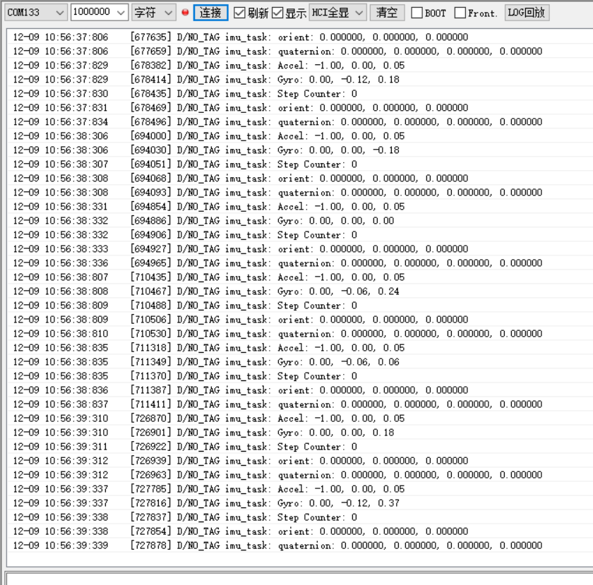

# IMU示例（RT-Thread）

## 支持的平台
- T-Display-SF32

## 概述
本例程中，包含两款imu(bhi260ap/icm20948)传感器数据获取和显示的示例：
- 获取imu sensor数据串口打印输出
- 获取imu sensor数据绘制到屏幕上

### menuconfig配置
1. 切换到project目录下，打开T-Display-SF32的menuconfig配置界面：
> scons --board=t-display-sf32 --menuconfig
2. 使能I2C1:

3. 根据imu型号选择使能bhi260ap/icm20948驱动：
 
 
4. 按下'D'键回车保存menuconfig配置并退出，重新编译工程。
 

### 编译和烧录
切换到例程project目录，运行scons命令执行编译：
```
scons --board=t-display-sf32_hcpu -j8
```
运行`build_t-display-sf32_hcpu\uart_download.bat`，按提示选择端口即可进行下载：
```
build_t-display-sf32_hcpu\uart_download.bat

     Uart Download

please input the serial port num:5
```
关于编译、下载的详细步骤，请参考[quick_start](https://docs.sifli.com/projects/sdk/latest/sf32lb52x/quickstart/build.html)的相关介绍。

串口打印如下：

