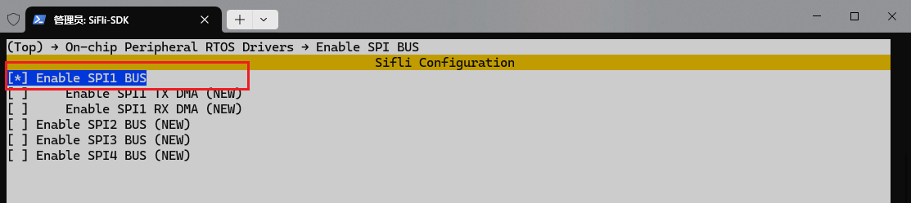
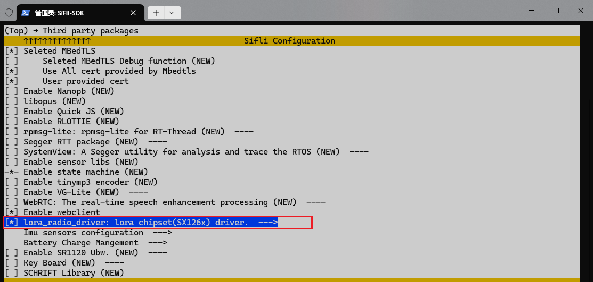
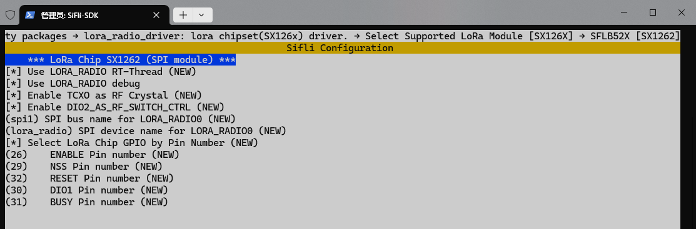
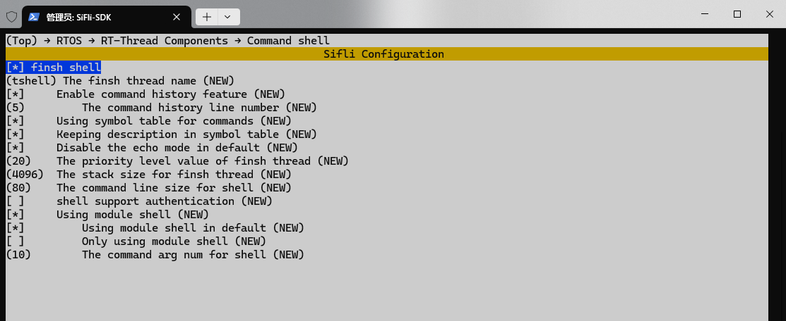

# LORA-SX1262示例（RT-Thread）

## 支持的平台
- T-Display-SF32

## 概述
本例程中，使用RT-Thread的Lora驱动，通过SX1262模块进行Lora发射和接收
- 通过屏幕修改lora频率、发射功率等参数
- 发射端发送数据，接收端接收数据并打印

### menuconfig配置
1. 切换到project目录下，打开T-Display-SF32的menuconfig配置界面：
> scons --board=t-display-sf32 --menuconfig
2. 使能SPI1:

3. 使能Lora驱动:


4. 打开Finsh终端:

   
### 编译和烧录
切换到例程project目录，运行scons命令执行编译：
```
scons --board=t-display-sf32_hcpu -j8
```
运行`build_t-display-sf32_hcpu\uart_download.bat`，按提示选择端口即可进行下载：
```
build_t-display-sf32_hcpu\uart_download.bat

     Uart Download

please input the serial port num:5
```
关于编译、下载的详细步骤，请参考[quick_start](https://docs.sifli.com/projects/sdk/latest/sf32lb52x/quickstart/build.html)的相关介绍。

### finsh 终端操作
| 命令索引 | 命令格式                                | 功能描述                     |
|----------|----------------------------------------|----------------------------|
| 0        | `lora probe`                           | LoRa 芯片探测               |
| 1        | `lora config <para> <val>`             | 配置参数                   |
| 2        | `lora cw <freq>,<power>`               | 发送载波                   |
| 3        | `lora ping <para1> <..>`               | 主从设备 ping-pong 测试     |
| 4        | `lora rx <rx_only> <timeout>`          | 接收数据（嗅探模式）       |


