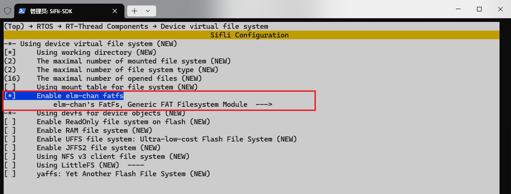
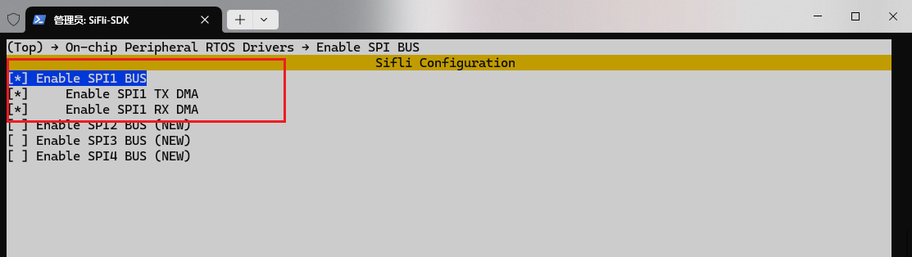
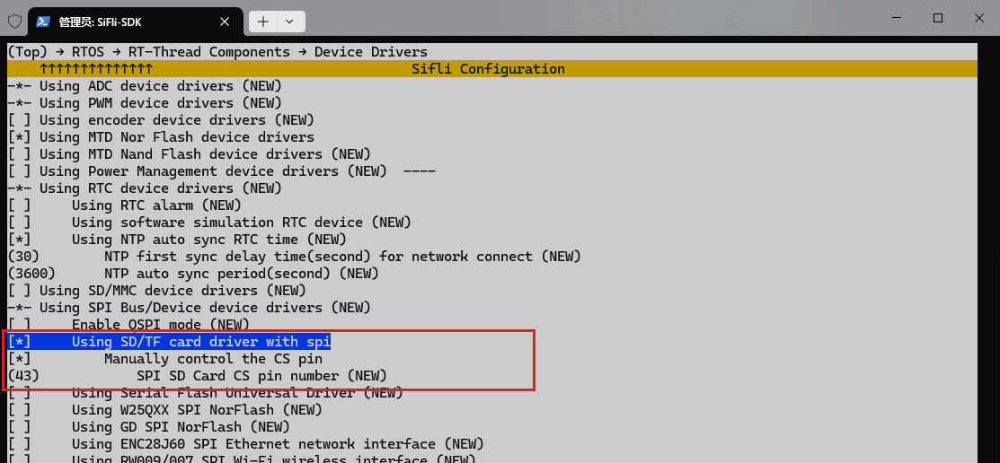
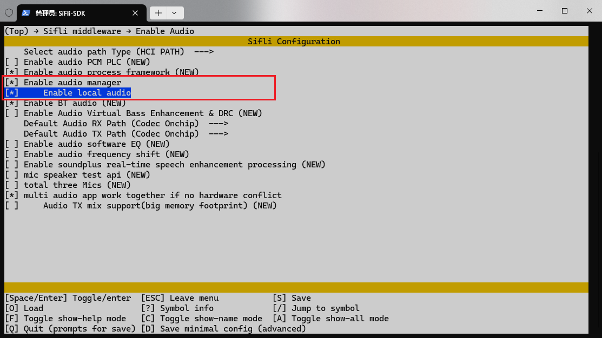
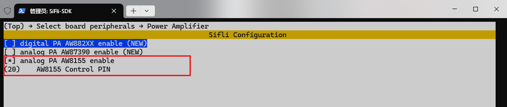
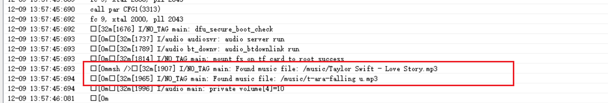

# Hello World示例（RT-Thread）

## 支持的平台
<!-- 支持哪些板子和芯片平台 -->
- T-Display-SF32

## 概述
本例程中，通过SD卡播放MP3音乐，并支持播放、暂停、恢复、停止、下一首等操作。
- SD卡插入T-Display-SF32后，会自动挂载文件系统，并输出当前'music'目录下的'mp3'和'wav'文件名。
- 通过finsh终端输入命令，可以控制MP3播放。
  
### menuconfig配置
1. 切换到project目录下，打开T-Display-SF32的menuconfig配置界面：
> scons --board=t-display-sf32 --menuconfig
2. 本例程需要读写文件，所以需要用到文件系统，配置FAT文件系统：

3. 开启SPI1驱动,SD卡使用SPI1接口：

4. 开启SD卡(MSD)驱动

5. 开启 AUDIO CODEC 和 AUDIO PROC

6. 开启 'AUDIO' 和 'audio manger' 和 'local audio'

7. 开启Power Amplifier驱动

8. 开启Finsh终端


### 编译和烧录
切换到例程project目录，运行scons命令执行编译：
```
scons --board=t-display-sf32_hcpu -j8
```
运行`build_t-display-sf32_hcpu\uart_download.bat`，按提示选择端口即可进行下载：
```
build_t-display-sf32_hcpu\uart_download.bat

     Uart Download

please input the serial port num:5
```
关于编译、下载的详细步骤，请参考[quick_start](https://docs.sifli.com/projects/sdk/latest/sf32lb52x/quickstart/build.html)的相关介绍。

### 运行结果



### finsh终端
| 命令索引 | 命令格式            | 功能描述           |
| -------- | ------------------- | ------------------ |
| 0        | `mp3_player play`   | 播放，从第一首开始 |
| 1        | `mp3_player pause`  | 暂停               |
| 2        | `mp3_player resume` | 从暂停恢复播放     |
| 3        | `mp3_player stop`   | 停止播放           |
| 4        | `mp3_player next`   | 下一首             |