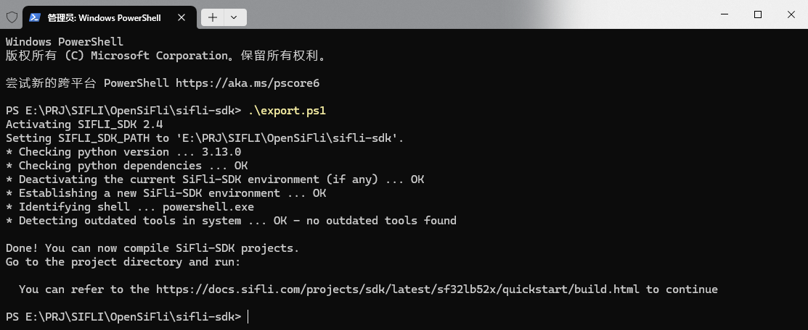
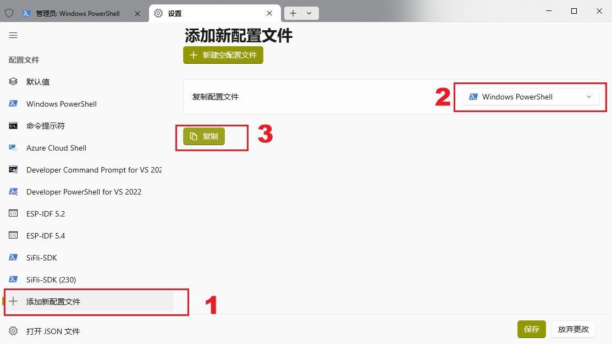
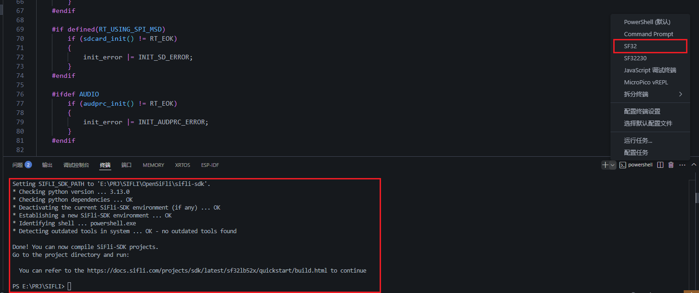

<div align="center" markdown="1">
  
</div>

<h1 align = "center"> T-Dispaly-SF32 </h1>


# SDK
点击网址跳转到SDK，下载并存放在你想要的路径上[https://github.com/Xinyuan-LilyGO/SlFli-SDK-Lilygo](https://github.com/Xinyuan-LilyGO/SlFli-SDK-Lilygo)

# 概述
T-Dispaly-SF32开发板是基于思澈科技(SiFli)最新推出的超低功耗AIoT MCU芯片SF32LB52X的开发平台。该开发板专为智能穿戴、智能家居、工业传感和物联网应用设计，集成了丰富的外设接口和传感器。

# 硬件特性
## 1、MCU
|            | SF32LB52X                                |
| ---------- | ---------------------------------------- |
| 型号       | SF32LB52X                                |
| 处理器     | Arm Cortex-M33 STAR-MC1大小核架构        |
| 大核(HCPU) | 192MHz，787 CoreMark                     |
| 小核(LCPU) | 24MHz                                    |
| 内存       | 576KB SRAM (512KB+64KB)                  |
| 蓝牙       | 双模蓝牙5.3 (BLE 5.3, Classic Bluetooth) |
| 图形引擎   | ePicassoTM 2.5D高性能图形引擎            |
| 工作电压   | 1.71V~3.63V                              |

## 2、外设模块
| 模块     | 型号              | 描述                                                 |
| -------- | ----------------- | ---------------------------------------------------- |
| 蓝牙     | -                 | 双模蓝牙5.3，支持BLE Audio，接收灵敏度-100dBm(1Mbps) |
| 音频     | -                 | 24-bit音频ADC/DAC，支持蓝牙音频传输                  |
| LoRa     | SX1262            | 433/868/915MHz，低功耗，高接收灵敏度                 |
| SD卡     | MicroSD           | 支持SDHC/SDXC                                        |
| IMU      | BHI260AP/ICM20948 | 三轴加速度计、陀螺仪、磁力计，低功耗模式             |
| 充电管理 | BQ21080           | USB PD快充，电池管理，支持多种充电协议               |
| 键盘     | TAC8418           | 8x8矩阵键盘，低功耗设计                              |

## 3、存储
| 模块  | 型号 |
| ----- | ---- |
| Flash | 16MB |
| PSRAM | 8MB  |
| TF    | -    |

## 4、显示
| 模块          | 型号     |
| ------------- | -------- |
| AMOLED(2.16") | (CO5300) |
| 触摸屏        | CST9220  |

## 5、接口
| 接口     | 类型   | 描述 |
| -------- | ------ | ---- |
| USB      | Type-C |      |
| 串口     | UART   |      |
| I2C      | 4通道  |      |
| SPI      | 2通道  |      |
| GPIO     | 45个   |      |
| 音频     | 3.5mm  |      |
| JTAG/SWD | -      |      |

## T-Dispaly-SF32功耗
| 模式              | 功耗   | 例程                     |
| ----------------- | ------ | ------------------------ |
| 关机              | 6uA    | Lilygo_examples/menu_app |
| 运行              | 26.6mA | Lilygo_examples/menu_app |
| 低功耗模式        | --     | Lilygo_examples/pm       |
| 运输模式          | 0mA    | Lilygo_examples/menu_app |
| LORA (TX +22dbm)  | 45mA   | Lilygo_examples/menu_app |
| LORA (RX)         | 30mA   | Lilygo_examples/menu_app |
| 最大亮度          | 27.7mA | Lilygo_examples/menu_app |
| 最小亮度          | 26.0mA | Lilygo_examples/menu_app |
| 蓝牙开启+音乐播放 | 44.7mA | Lilygo_examples/menu_app |


# 环境安装
## Windows

### 开发环境准备
1. Python(version:3.9-3.14):安装完成后，确保将 Python 添加到系统的环境变量中。
2. Terminal setup:SiFli-SDK 脚本安装仅支持powershell，推荐使用PowerShell 7版本。
3. 将本仓库克隆到本地。

### 安装工具
1. 打开 PowerShell 终端，运行以下命令：
```powershell
    cd OpenSiFli\sifli-sdk // 进入SiFli-SDK目录
    .\export.ps1
```

##### 注意:
每次打开新的终端窗口都需要在SDK根目录下运行一次 export.ps1 脚本设置环境变量。注意，必须要在SDK根目录下运行该脚本，否则会导致运行失败或者编译错误。

### Windows Terminal 快捷配置
如果需要经常运行 SiFli-SDK，并且希望在每次打开终端时自动设置环境变量，可以新建一个 Windows Terminal 配置文件，具体步骤如下：

1. 打开 Windows Terminal,按下 `Ctrl + '+'`, 打开设置。点击添加新的配置文件，选择复制配置文件 Windows PowerShell，然后按照以下步骤进行操作：

2. 将名称改为SiFli-SDK,把命令行的配置改为如下,启动目录改为使用父进程目录,最后的export.ps1文件位置改成你的SDK路径:
```powershell
%SystemRoot%\System32\WindowsPowerShell\v1.0\powershell.exe  -ExecutionPolicy Bypass -NoExit -File  D:\SIFIL\SiFli-SDK\export.ps1
```

##### 后续只需要在任意代码目录下打开Windows Terminal，点击右上角的下拉菜单，选择SiFli-SDK，就可以自动设置环境变量了。在新打开的窗口中就可以使用SDK的编译和下载命令了

### VSCode 快捷配置
如果使用VSCode，可以按照以下步骤进行配置：

1. 打开 VSCode,找到settings文件，在文件加入下面代码，修改你的SIFLI路径，完成后保存，即可在vscode快捷打开SIFLI终端。
```c
    "terminal.integrated.profiles.windows": {
        "SF32": {
            "path": "C:\\WINDOWS\\System32\\WindowsPowerShell\\v1.0\\powershell.exe",
            "args": [
                "-ExecutionPolicy",
                "Bypass",
                "-NoExit",
                "-File",
                "E:\\PRJ\\SIFLI\\OpenSiFli\\sifli-sdk\\export.ps1"  //修改成你的SDK安装路径
            ]
        }
    }
```


## Linux and macOS
请参考[SFILI-SDK macOS and Linux Installation](https://docs.sifli.com/projects/sdk/v2.4/sf32lb52x/quickstart/install/script/unix.html)

# 编译和烧录
1. 先按照安装环境的要求安装好依赖包，并配置好环境变量(以下命令在powershell中执行)
```powershell
    cd SIFLI\T-Display-SF32\examples\rt_os\rt_driver\project //进入工程目录
    scons --board=t-display-sf32_hcpu -j8   //编译
    build_t-display-sf32_hcpu\uart_download.bat     //烧录
```
2. 等待编译完成，执行build_t-display-sf32_hcpu\uart_download.bat命令，在输入设备端口号，即可烧录。
3. 示例图片


# 🎯官网文档
本例程参考官方网站给出示例，具体文档请参考以下链接：
[SFILI-SDK](https://docs.sifli.com/projects/sdk/v2.4/sf32lb52x/index.html)
[SFILI-WIKI](https://wiki.sifli.com/)
[RT-Thread](https://www.rt-thread.org/document/site/#/rt-thread-version/rt-thread-standard/README)

# FAQ

#### 1. 为什么在menuconfig中已经配置了蓝牙相关宏，但是无法正常使用蓝牙功能？
可能原因：
1.在SConript和SConstruct中，没有添加LCPU的编译选项相关文件, lcpu_general_ble_img 里面是LCPU默认的代码，里面包含了BLE的启动，对于用户只使用BLE的基本功能，可以将lcpu_img.c加入用户HCPU工程，参考BLE里面的示例使用。。
```c
SConript:
    objs.extend(SConscript(os.path.join(SIFLI_SDK, 'example/rom_bin/lcpu_general_ble_img/SConscript'), variant_dir="lcpu_patch", duplicate=0))

SConstruct:
    AddLCPU(SIFLI_SDK,rtconfig.CHIP,"../../src/lcpu_img.c")
```