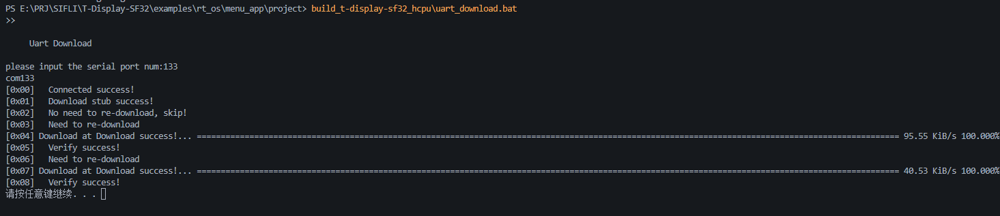

<div align="center" markdown="1">
  
</div>

<h1 align = "center"> T-SF32-Dispaly </h1>


# SDK
点击网址跳转到SDK，下载并存放在你想要的路径上[https://github.com/Xinyuan-LilyGO/SlFli-SDK-Lilygo](https://github.com/Xinyuan-LilyGO/SlFli-SDK-Lilygo)
如果要更新SDK版本，请查看update_sdk_install.md文档，[https://github.com/Xinyuan-LilyGO/SlFli-SDK-Lilygo/blob/master/update_sdk_install.md](https://github.com/Xinyuan-LilyGO/SlFli-SDK-Lilygo/blob/master/update_sdk_install.md)

# 概述
T-SF32-Dispaly开发板是基于思澈科技(SiFli)最新推出的超低功耗AIoT MCU芯片SF32LB52X的开发平台。该开发板专为智能穿戴、智能家居、工业传感和物联网应用设计，集成了丰富的外设接口和传感器。

# 硬件特性
## 1、MCU
|            | SF32LB52X                                |
| ---------- | ---------------------------------------- |
| 型号       | SF32LB52X                                |
| 处理器     | Arm Cortex-M33 STAR-MC1大小核架构        |
| 大核(HCPU) | 192MHz，787 CoreMark                     |
| 小核(LCPU) | 24MHz                                    |
| 内存       | 576KB SRAM (512KB+64KB)                  |
| 蓝牙       | 双模蓝牙5.3 (BLE 5.3, Classic Bluetooth) |
| 图形引擎   | ePicassoTM 2.5D高性能图形引擎            |
| 工作电压   | 3.2V-4.7V                                |

## 2、外设模块
| 模块         | 型号              | 描述                                                 |
| ------------ | ----------------- | ---------------------------------------------------- |
| 蓝牙         | -                 | 双模蓝牙5.3，支持BLE Audio，接收灵敏度-100dBm(1Mbps) |
| 音频         | -                 | 24-bit音频ADC/DAC，支持蓝牙音频传输                  |
| LoRa         | SX1262            | 433/868/915MHz，低功耗，高接收灵敏度                 |
| TF卡         | MicroSD           | 支持SDHC/SDXC                                        |
| IMU          | BHI260AP          | 三轴加速度计、陀螺仪、磁力计，低功耗模式             |
| 充电管理     | SGM41562B         | USB PD快充，电池管理，支持多种充电协议               |
| 键盘         | TAC8418 + AW21009 | 8x8矩阵键盘，低功耗设计                              |
| GPS          | L76K              | 支持NMEA,CASIC协议，高精度定位                       |
| 温湿度传感器 | BME280            |                                                      |
| 红外发射     | VSMY14940         |                                                      |
| 震动马达     | AW86224           |                                                      |

## 3、存储
| 模块  | 型号 |
| ----- | ---- |
| Flash | 16MB |
| PSRAM | 8MB  |

## 4、显示
| 模块          | 型号     |
| ------------- | -------- |
| AMOLED(2.16") | (CO5300) |
| 触摸屏        | CST9220  |

## 5、接口
| 接口     | 类型   | 描述 |
| -------- | ------ | ---- |
| USB      | Type-C |      |
| 串口     | UART   |      |
| I2C      | 4通道  |      |
| SPI      | 2通道  |      |
| GPIO     | 45个   |      |
| 音频     | 3.5mm  |      |
| JTAG/SWD | -      |      |

## T-SF32-Dispaly功耗
请查看[功耗测试报告](./lowpowertest/T-SF32-Display-power.pdf)，在“./lowpowertest/T-SF32-Display-power.pdf”目录。

# 环境安装
## Windows
请参考[T-SF32-Display SFILI-SDK  Windows Installation](https://github.com/Xinyuan-LilyGO/SlFli-SDK-Lilygo/blob/master/readme.md)

## Linux and macOS
请参考[SFILI-SDK macOS and Linux Installation](https://docs.sifli.com/projects/sdk/v2.4/sf32lb52x/quickstart/install/script/unix.html)

# 编译和烧录
1. 先按照安装环境的要求安装好依赖包，并配置好环境变量(以下命令在powershell中执行)
```powershell
    cd SIFLI\T-Display-SF32\examples\rt_os\rt_driver\project //进入工程目录
    scons --board=t-display-sf32_hcpu -j8   //编译
    build_t-display-sf32_hcpu\uart_download.bat     //烧录
```
2. 等待编译完成，执行build_t-display-sf32_hcpu\uart_download.bat命令，在输入设备端口号，即可烧录。
3. 示例图片




# 🎯官网文档
本例程参考官方网站给出示例，具体文档请参考以下链接：
[SFILI-SDK](https://docs.sifli.com/projects/sdk/v2.4/sf32lb52x/index.html)
[SFILI-WIKI](https://wiki.sifli.com/)
[RT-Thread](https://www.rt-thread.org/document/site/#/rt-thread-version/rt-thread-standard/README)

# FAQ

#### 1. 为什么在menuconfig中已经配置了蓝牙相关宏，但是无法正常使用蓝牙功能？
可能原因：
1.在SConript和SConstruct中，没有添加LCPU的编译选项相关文件, lcpu_general_ble_img 里面是LCPU默认的代码，里面包含了BLE的启动，对于用户只使用BLE的基本功能，可以将lcpu_img.c加入用户HCPU工程，参考BLE里面的示例使用。。
```c
SConript:
    objs.extend(SConscript(os.path.join(SIFLI_SDK, 'example/rom_bin/lcpu_general_ble_img/SConscript'), variant_dir="lcpu_patch", duplicate=0))

SConstruct:
    AddLCPU(SIFLI_SDK,rtconfig.CHIP,"../../src/lcpu_img.c")
```

#### 2. Impeller一直烧录失败，是什么原因？
可能原因：
1. Impeller烧录需要使用USB Type-C接口，请确保使用正确的接口。
2. 确保设备端口号正确，可以使用设备管理器查看设备端口号。
3. 确保设备已经正确连接，可以使用设备管理器查看设备是否已经连接。
4. 确保设备已经正确安装驱动，驱动文件路径`tools/VisualCppRedist_54_Setup.7z`,[c++Driver](./tools/VisualCppRedist_54_Setup.7z)。

#### 3.为什么出厂固件(menu_app)关机之后,USB充电无法开机？
因为出厂固件(menu_app)在关机之后,会进入低功耗模式,低功耗模式下，只有按键才能唤醒设备，而USB充电无法唤醒设备，但是可以给设备充电，所以可以正常充电，但是无法开机。
